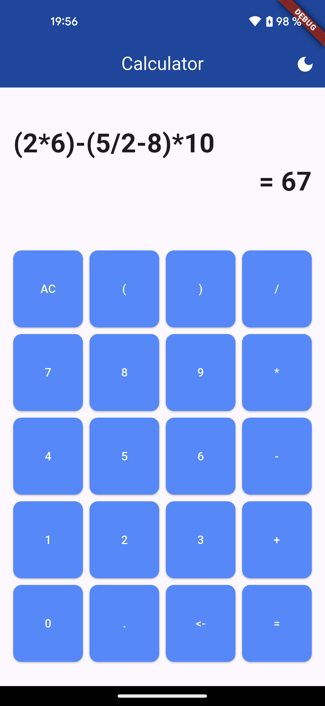
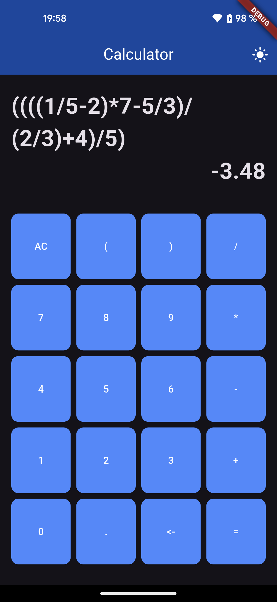

# 🧮 Simple Calculator App

A basic calculator app built with Flutter and Dart.  
It follows mathematical rules, supports parentheses, and ensures valid input while typing.

## 🚀 Features

✔️ Basic arithmetic operations (+, -, ×, ÷)  
✔️ Supports parentheses for more complex calculations  
✔️ Prevents invalid input (e.g., no consecutive operators, correct decimal placement, etc.)  
✔️ Dark mode support – customize the appearance to your preference  

## 📸 Screenshot

  
  

